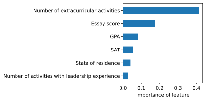
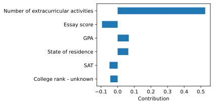
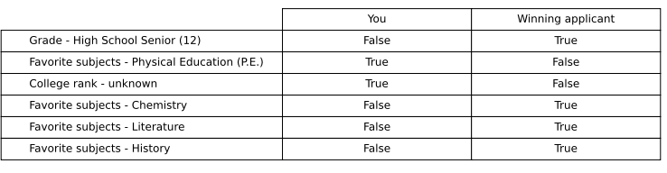
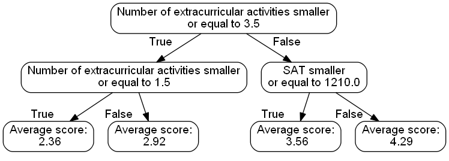

</a>
# explainy - black-box model explanations for humans


[](https://pypi.python.org/pypi/explainy)
[](https://app.travis-ci.com/github/MauroLuzzatto/explainy?branch=master)
[](https://explainy.readthedocs.io/en/latest/?version=latest)
[](https://pypi.org/project/explainy)
[](https://github.com/ambv/black)


explainy is a library for generating explanations for machine learning models in Python. It uses methods from **Machine Learning Explainability** and provides a standardized API to create feature importance explanations for samples. The explanations are generated in the form of plots and text.

explainy comes with four different algorithms to create either global or local and contrastive or non-contrastive machine learning model explanations.


## Documentation
https://explainy.readthedocs.io


## Install explainy

```
pip install explainy
```

## Usage

```python
from explainy.explanations import PermutationExplanation

explainer = PermutationExplanation(
	X, y, model, number_of_features=10
)
for sample_index in range(10):
    explanation = explainer.explain(sample_index=sample_index)
    explainer.print_output()
    explainer.plot()
    explainer.save(sample_index)

```


## Model Explanations

Method				|Type | Explanations | Classification | Regression | 
--- 				| --- | --- | :---: | :---: | 
[Permutation Feature Importance](https://explainy.readthedocs.io/en/latest/explainy.explanation.html#module-explainy.explanation.permutation_explanation)	| Non-contrastive | global |  :star: | :star:|
Shapley Values		| Non-contrastive | local |   :star: | :star:|
Global Surrogate Model|Contrastive | global | :star: | :star:|
Counterfactual Example| Contrastive | local |:star: | :star:|


Description
- global: 
- local:
- contrastive:	
- non-contrastive:	


## Features

TODO


## Explanations

### Permutation Feature Importance

Permutation feature importance measures the increase in the prediction error of the model after we permuted the feature's values, which breaks the relationship between the feature and the true outcome [1].

#### Characteristics
- global
- non-contrastive



### Shapley Values
A prediction can be explained by assuming that each feature value of  the instance is a "player" in a game where the prediction is the payout.  Shapley values (a method from coalitional game theory) tells us how  to fairly distribute the "payout" among the features. The Shapley value is the average marginal contribution of a feature value across all possible coalitions [1].

#### Characteristics
- local
- non-contrastive




### Counterfactual explanations
Counterfactual explanations tell us how the values of an instance have to change to significantly change its prediction. A counterfactual explanation of a prediction describes the smallest change to the feature values that changes the prediction to a predefined output. By creating counterfactual instances, we learn about how the model makes its predictions and can explain individual predictions [1].

#### Characteristics
- local
- contrastive




### Global Surrogate Model (Decision Tree)
A global surrogate model is an interpretable model that is trained to approximate the predictions of a black box model. We can draw conclusions about the black box model by interpreting the surrogate model [1].

#### Characteristics
- global
- contrastive




## Source

[1] Molnar, Christoph. "Interpretable machine learning. A Guide for Making Black Box Models Explainable", 2019. https://christophm.github.io/interpretable-ml-book/

## Authors
* **Mauro Luzzatto** - [Maurol](https://github.com/MauroLuzzatto)

